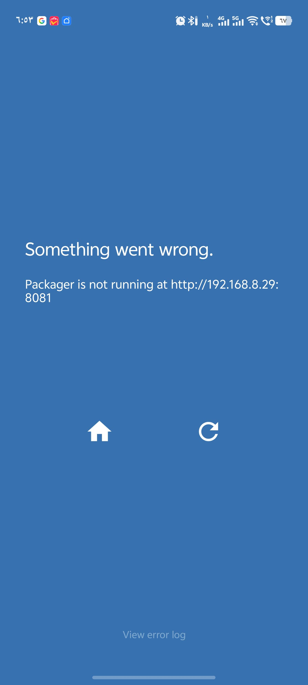
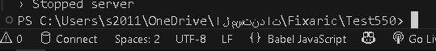
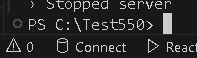

# expo arabic folder issue or Path
عند تشغيل مشروع React Native باستخدام Expo Go، قد تواجه مشكلة في عدم تعرف التطبيق على المشروع أو عدم عمله بشكل صحيح.

# مشكلة تطبيق Expo Go 

**عدم تعرف تطبيق Expo Go على المشروع يعود إلى أن مسار ملف المشروع يحتوي على أحرف عربية، حتى لو تم تغيير لغة النظام إلى الإنجليزية. السبب هو أن بعض المجلدات (مثل مجلد المستخدم) تبقى باللغة العربية إذا كانت لغة تثبيت نظام ويندوز الأصلية هي العربية، وهذا يؤدي إلى مشاكل في تشغيل المشروع عبر Expo Go.**

 # الحل 
 
  **نقل المشروع الى القرص C:// مباشرة**
  
 
 
 **الحل اخر تثبيت نظام الويندوز باللغة الإنجليزية من البداية أفضل للمبرمجين لتجنب كثير من المشاكل المستقبلية في التعامل مع الأدوات والبيئات التطويرية.**

 

 
